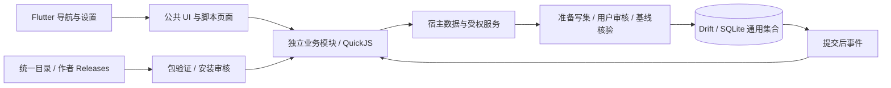

# 当前架构

核对日期：2026-10-09。生产使用 v3 模块定义、格式 2 的 ZIP 包、宿主 API 1.10.0 和 Drift schema 2。使用能力见 [项目首页](../README.md)，具体协议分别由 [宿主](MODULE_HOST.md)、[SDK](MODULE_SDK.md) 和 Schema 定义。

## 宿主与业务

宿主负责主题、导航、设置、安装/权限审核、通用数据与恢复；任务、视图、AI、课表和导入放在模块中。脚本不能直接调用数据库、任意 Flutter 控件或操作系统服务。界面包仅声明颜色、模板与共用控件呈现，不执行脚本。

每个脚本模块分开使用计算和交互运行时，避免等待用户操作阻塞业务计算。模块通过实例绑定的能力接口交换数据；跨模块需要精确服务权限。引擎与 App 共进程，资源/能力约束不等同于操作系统级沙箱，具体限额见宿主文档。

## 数据与更新

业务数据保存到 `host_*` 通用集合。命令先准备不可变写入计划，宿主确认并检查记录/集合基线后事务提交；事件在提交后发出。模块更新使用不可变原包与候选数据空间，验证及迁移成功才切换活动指针，失败恢复旧版本。

schema 1 升级前创建 SQLite 备份；旧表、原始来源和版本留作迁移档案。停用与普通卸载保留数据，彻底删除和不兼容回退走明确审核/快照恢复流程。

宿主与业务包分别发布。模块代码变更须增加语义版本，不能覆盖同一 ID + version 或已发布 Release。客户端资源清单决定首次安装默认包，既有模块不会因更新 APK 自动升级。退出默认分发的视图由退役清单执行一次保留数据卸载，并从商店目录中过滤；已有任务与项目服务不受影响。

## 设备、AI 与分发

Android / Windows 共享 Flutter 宿主和脚本契约，浏览器采集目前仅实现 Android。AI 由设备直连模型接口，连接配置属于 AI 模块，密钥保持在系统安全存储；工具计划经过实际权限与用户审核。模块目录、作者索引和 GitHub Releases 已提供用户发起的安装/更新，签名审核市场服务端尚未建立。

## 后续设计

账号、端到端加密同步、自有云服务、恢复码、冲突合并和正式签名为待实施方向。原始技术候选、密钥分层、同步规则及验收目标保留在 [初始设计](archive/INITIAL_DESIGN.md)；后续实现前需按当前模块边界重新审阅，阶段待办见 [项目交接](../PROJECT_HANDOFF.md)。
