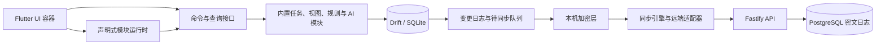

> 历史归档：保留当时的方案、状态与验证结果。当前文档见 [文档导航](../README.md)，历史构建和截图可能只存在于原验收工作区。

# 序点设计方案

状态：v2 实施设计稿，2026-09-30 按当前代码核对。本文同时记录现有实现和后续目标，实际进度以 [项目首页](../../README.md) 为准。2026-09-29 起采用新客户端结构与独立数据库文件，不迁移旧本地数据库。

当前已实现模块注册、命令/查询/事件、基础任务、自定义字段、声明式列表、规则/模板、模块版本管理、AI 模块提案，以及客户端模块包验证与导入。端到端加密、账号、自有云同步、市场服务端、完整任务编辑和看板仍待实现。下文第 6、7 节为待实施设计；第 8、9 节分别标注客户端现状与后续目标。

## 1. 目标与边界

首版目标是服务一个人在 Android 和 Windows 上管理任务。任务操作先写入本机，断网时仍可使用。当前仅提供本地能力；后续计划加入自有云密文同步，由用户保管恢复码，服务器不持有个人任务、私有模块配置和 AI 密钥的解密能力。

可扩展性以稳定接口和声明式配置实现。数据、任务和基础 UI 是必需模块；附加视图、规则、AI、同步与市场能力可独立启停。市场只分发数据定义，不执行下载的 Dart、JavaScript 或原生代码。附加模块故障应被限制在所属页面或动作，基本任务读写始终可用。

首版不包括多人协作、Web 客户端、WebDAV、任意插件代码、服务端 AI 代理和服务器明文搜索。这些能力若以后加入，应延续本文的模块接口和密文边界。

## 2. 体验与信息架构

### 2.1 两端布局

| 场景 | Android | Windows |
| --- | --- | --- |
| 当前主导航 | 窄屏底部“今天、收件箱、项目、模块”，扩展超过四项时用“更多” | 宽屏左侧导航，窄窗口切到底栏 |
| 当前任务操作 | 任务列表、完成状态、自定义字段与基础任务详情编辑（底部面板） | 同一任务列表能力；基础任务详情使用右侧模态面板 |
| 当前快速输入 | 支持 quickAdd 的页面显示底部添加栏 | 同一添加栏；完整键盘快捷键待实现 |
| 当前 AI 入口 | 顶部按钮打开 Sheet | 宽度至少 1100 时打开侧面板，较窄时打开 Sheet |

导航按窗口宽度适配：小于 820 使用底栏，至少 820 使用侧栏。模块注册导航和页面语义，客户端统一控制视觉样式。完整任务详情、桌面列表/详情分栏与窄屏详情全屏属于后续目标。

当前快速输入用于添加任务，AI 使用独立面板。模块提案已显示资源与权限差异，用户确认后安装。后续目标是补充“添加任务 / 问 AI”输入模式、当前页/项目/任务上下文范围、发送前内容预览与确认、任务变更提案、撤销及恢复默认布局。

当前“今天”按设备本地日期筛选截止日不晚于今天或计划日为今天的未完成顶层任务；“收件箱”显示未归入项目的未完成顶层任务。两者均排除归档和删除任务。逾期/今日到期/今日计划分组、用户时区设置和看板尚未实现；未来列表与看板读取同一任务集合。

### 2.2 首版任务闭环

本节为首版目标。当前已提供项目/任务创建、子任务创建命令、标题/优先级/日期修改命令、完成/重新打开和自定义字段编辑；完整任务编辑、备注、标签、移动、归档、删除/恢复、搜索与子任务界面仍待实现。

用户可创建项目、任务和子任务；编辑标题、备注、截止日期、计划日期、优先级、标签和完成状态；移动、归档及删除；搜索本机任务。任务先支持日期级截止时间，所有日期作为日历日保存，避免跨时区同步后自动移到前后一天。精确到时刻的提醒与重复任务留待后续版本。

删除先写入墓碑并同步，界面提供恢复入口。首版不对单条任务历史实施不可恢复清理；账号删除须清除服务端该账号的全部密文及恢复信封。归档与删除是不同状态。

## 3. 客户端与服务端边界

以下为目标架构。当前代码已实现客户端本地数据库与任务变更日志；加密层、同步引擎、远端适配器、Fastify API 和 PostgreSQL 工程尚未实现。



- **客户端**：Flutter/Dart。Riverpod 负责依赖与视图状态；Drift/SQLite 保存本地实体、索引、私有配置、变更日志和同步状态。Android 与 Windows 共享领域逻辑及声明式渲染器，只在导航、窗口、系统密钥存储和文件接口处适配平台。
- **云端**：TypeScript/Fastify + PostgreSQL 的模块化单体。账号和会话、密文同步、恢复信封、公开市场及审核分成明确模块。服务器不调用任务领域命令，不解析个人任务字段。
- **协议**：客户端与自有云使用带版本号的 HTTPS API。客户端在本地完成字段合并、搜索、规则执行、AI 请求和配置渲染。

当前目录为 `client/`、`packages/schemas/`、`docs/`、`scripts/` 与 `assets/brand/`；未来服务端置于 `server/`。跨端共享计划使用 JSON Schema 和协议样例；Dart 与 TypeScript 各自维护类型及契约测试。

## 4. 模块系统

### 4.1 核心接口

核心目录提供模块注册、能力与权限检查、命令/查询路由、事件和 UI 插槽。动态模块的安装/恢复/启停由 `DeclarativeRuntimeController` 协调，`AppModule` 当前仅声明 manifest 与 UI 注册。完整生命周期回调和依赖图处理仍待补充。任务实体写入集中在任务服务；扩展经公开命令使用任务能力。

内置目录由 `BuiltinModuleRegistration` 描述功能名称、类型和关闭策略；`BuiltinModuleController` 持久化并恢复启用状态，启动时先恢复内置模块，再恢复动态模块。原生项目/AI 及内置今天/收件箱可关闭，模块管理受保护，基础任务读写与设置保持可用。启停校验活跃依赖，关闭保留数据；注册表保留已关闭内置模块的 ID，防止动态模块替换。当前原生模块的页面移除会释放页面订阅，AI 会关闭请求客户端并阻止待审核提案继续应用；后续具有独立后台服务的原生模块需要补充通用生命周期接口。

模块清单声明 `id`、不可变的语义化 `version`、`coreApi`，以及可选的依赖、`requiresCapabilities` 与 `permissions`。ID 使用反向域名形式，例如 `app.task.views.board`。当前检查 ID/版本格式、非空 coreApi、依赖存在和 capability；已校验依赖循环，启动按依赖顺序恢复并显示失败原因；coreApi 兼容范围尚未实现。动态模块同一 ID + version 的源码和来源不可覆写；更新发布新版本，降级通过历史回退。

运行能力与模块权限现已分开。当前基础运行能力使用 `tasks.query`、`tasks.command`、`ui.registry` 等 capability；模块权限使用 `tasks.read`、`tasks.write`、`ui.register` 等 permission。Capability 用于判断运行环境是否提供服务，Permission 用于限制模块是否允许调用该服务。授权必须在命令、查询和 UI 注册边界检查，不依赖页面隐藏按钮。事件只携带最小必要的 ID 和变更摘要，订阅者需要更多数据时再通过受权查询接口读取。规则执行链携带 automation depth 与已执行 rule trace，同一规则在一条链内至多执行一次，默认最大深度为 8；规则触发、条件跳过、成功和失败都写入本地持久化执行记录。失败记录保存原事件 payload，可精确重试单条规则；重试时事件数据沿用原记录，但条件查询读取当前任务快照，不尝试恢复旧数据库状态。

UI 插槽已定义为 `navigationPrimary`、`workspacePage`、`workspaceHeaderActions`、`taskDetailSections`、`taskEditorSections`、`inputActions`、`projectViews` 和 `settingsSections`。当前主导航消费 `navigationPrimary`；其他插槽的完整渲染接入和通用错误边界仍待实现。模块注册完整页面或区块，容器统一响应式布局、主题和空状态。停用动态模块保留数据；卸载可保留数据或彻底删除。

### 4.2 声明式模块格式

市场和 AI 生成的动态模块采用版本化 JSON 文档，JSON Schema 是格式契约；客户端实际使用手写 `DeclarativeModuleParser`、页面/字段运行时及规则/模板引擎校验，尚未接入通用 JSON Schema 执行器。文档仅描述内置能力，运行时不执行脚本、SQL、任意 URL 请求或下载代码。当前视图仅支持 `task.list` 与过滤 AST，可保持原语义的基础筛选在 SQLite 执行，其余保留客户端过滤；声明式排序、分页和统一资源预算仍待补充。列表通过 QueryBus 订阅任务、字段值和字段定义的关联查询，规则按 ID 获取快照。规则支持受限事件和动作，并限制自动化深度。模板支持 `text/number/boolean/date/datetime/select/multiSelect` 参数，使用 `$param.<id>` 引用，执行前校验类型、必填、默认值、选项和引用。

v1 顶层契约位于 `packages/schemas/declarative-module-v1.schema.json`。当前可执行资源为 page、view、field、template 和 rule；`layouts` 必须省略或为空数组，非空值在运行时拒绝：

```json
{
  "formatVersion": 1,
  "manifest": {
    "id": "app.task.views.sample",
    "version": "1.0.0",
    "coreApi": "1",
    "dependencies": [],
    "requiresCapabilities": ["tasks.query", "ui.registry"],
    "permissions": ["tasks.read", "ui.register"]
  },
  "pages": [],
  "views": [],
  "fields": [],
  "templates": [],
  "rules": [],
  "layouts": []
}
```

当前 Proposal 在确认前执行解析、权限白名单、运行时语义和候选注册表校验，并生成资源/权限 Diff；确认时再次检查当前版本，避免过期提案覆盖。模块源码、版本来源和字段定义在数据库事务中保存，随后更新注册表与规则/模板运行时；注册表本身用候选副本验证后提交。当前没有可视化预览沙箱，也未实现数据库与内存运行时之间的完整原子提交。完整 Schema 契约一致性、资源预算、coreApi 兼容检查、预览和恢复默认布局仍需实现。

## 5. 本地数据与命令

### 5.1 领域实体

| 当前实体 | 关键字段与约束 |
| --- | --- |
| `Project` | 稳定 ID、名称、归档时间、创建/更新时间 |
| `Task` | 稳定 ID、可空项目 ID、可空父任务 ID、标题、备注、完成时间、优先级、截止日、计划日、归档时间、删除时间、创建/更新时间 |
| `Label` | 稳定 ID、名称、颜色；任务与标签多对多 |
| `FieldDefinition` / `FieldValue` | 模块命名空间、字段类型/config/active；任务 ID、字段 key、类型校验后的 JSON 值 |
| `ModuleInstallation` | 模块 ID、当前版本/源码、installed/enabled、当前来源 |
| `ModuleVersion` | 不可变版本源码及 provenance，回退恢复目标版本来源 |
| `RuleExecution` | 原事件与 payload、状态、深度、动作计数、重试来源 |
| `AppSetting` | 非秘密配置、设备 ID 与本机操作计数；API Key 在系统安全存储 |
| `ChangeOperation` | 操作 ID、设备 ID、递增计数、实体/动作/payload、创建时间与 synced 标记 |

当前没有排序键、字段因果版本或 `SyncState`/冲突表；这些属于同步阶段的数据模型。标签、备注、归档与删除的表字段已存在，完整命令和 UI 尚未实现。数据库使用 `xudian_v9.sqlite`，Drift schemaVersion 为 1，已有结构变化仍需编写迁移。

实体与操作 ID 在客户端生成，建议使用 UUIDv7；本地数据库以 ID 和常用查询条件建索引。子任务通过 `parentTaskId` 形成树，禁止循环和跨项目产生无效层级。优先级首版固定为无、低、中、高，避免不同模块解释不一致。任务主表保留稳定基础字段，自定义值单独存储，避免每新增字段都迁移主表。

当前任务命令为 `project.create`、`task.create`、`task.updateFields` 和 `task.setCompleted`，后者支持完成与重新打开。`CommandBus` 校验模块权限，服务校验业务不变量，任务写入与本机变更日志在同一 SQLite 事务提交，提交后发布事件。字段命令为 `field.set / field.clear / field.setMany`：权限与命名空间检查后，同事务写字段与操作日志，提交后发布 `task.updated`，沿用规则深度/trace 与模板外层提交的事件延迟；批量值校验或持久化失败整体回滚，相同值不重复记录。日期/时间、有限数字、选项与多选唯一性在存储层校验。后续同步需补齐所有可同步数据的操作记录；搜索及 FTS 尚未实现。

### 5.2 日期与视图规则

`dueDate` 与 `plannedDate` 使用 `YYYY-MM-DD` 日历日，当前 `$today` 取设备本地日期，尚无用户时区设置。内置“今天”用 OR 条件匹配截止日不晚于今天或计划日为今天，每条任务只出现一次，当前未分组或标出两个原因。完成、归档、删除和子任务默认不进入今天和收件箱。未来跨设备同步保持日期值，不转换为 UTC 零点时间戳。

## 6. 端到端加密与账号恢复

实施状态：尚未实现。本节记录目标协议与验证要求；当前客户端仅在系统安全存储保存 AI API Key，未提供同步密钥、恢复码或账号。

### 6.1 密钥分层

首次启用云同步时，设备使用系统安全随机数生成 256 位账户数据密钥。按用途派生记录加密密钥，使用成熟的认证加密实现（拟采用 AES-256-GCM；算法、随机数和跨平台实现须做独立验证）。每条密文使用全新随机 nonce；关联数据绑定账号 ID、操作 ID、格式版本和记录类型。服务端保存密文、nonce、必要的路由元数据，不保存数据密钥。

恢复码由设备随机生成，编码为便于人工保存并带校验的高熵字符串，强度不低于 256 位。设备由恢复码派生包装密钥，使用认证加密包装账户数据密钥，并把恢复信封上传。由于恢复码本身有足够随机熵，不依赖人类口令强度；绝不将用户自选短密码直接当作恢复码。设备只展示恢复码一次，要求用户确认已保存，再允许依赖云端恢复。丢失所有已登录设备和恢复码后，服务端不能恢复明文。

账号登录与数据解密分离。服务端负责验证账户身份并签发可撤销会话；登录凭据本身不解密任务。新设备先登录，再输入恢复码下载并解开恢复信封，然后拉取密文日志。Android 使用系统 Keystore 封装本机密钥；Windows 使用系统凭据/DPAPI 适配器。AI API 密钥在客户端通过系统安全凭据存储使用，不进入 SQLite、普通任务表或日志；端点和模型等非秘密配置可保存在 AppSettings。未来跨设备副本作为单独的端到端加密秘密记录同步，导入新设备后再写入本机安全存储。

首版同步加密不等于本机 SQLite 全盘加密：本机明文数据库受设备账号、系统磁盘加密和应用访问控制保护。若产品要求应用级本地数据库加密，应单列里程碑并验证 Windows 与 Android 的密钥生命周期。设备撤销可立即撤销登录令牌，但已取得旧密钥的设备仍能解密旧数据；真正的加密撤销需要密钥轮换与历史重加密，首版不得宣称已具备该能力。

### 6.2 威胁与验证

加密保证服务器无法读取个人任务、私有配置与 AI 凭证，也能检测密文篡改。服务器仍能看到账号、设备、上传时间、密文大小和操作数量；流量模式不隐藏。客户端记录已处理操作 ID、设备计数和拉取高水位，拒绝重复操作、计数倒退和认证失败的记录。恶意服务器对新设备实施完整日志回滚或对不同设备呈现不同历史的问题，不能仅靠传输加密完全解决；公开上线前须进行协议威胁评审，必要时加入可验证的检查点机制。

## 7. 离线同步与冲突

实施状态：尚未实现。已有 `ChangeJournal / ChangeOperations` 本机日志基础，但尚无因果上下文、同步传输、拉取游标或冲突合并；下面的流程与 API 均为设计。

### 7.1 操作流

1. 客户端在本地事务中完成写入并记录操作；仅本地模式停在此处。
2. 同步引擎把待同步操作加密为信封，远端适配器负责认证、上传与重试。适配器不读取操作明文。
3. 服务端以 `(accountId, operationId)` 做幂等去重，为新信封分配账号内单调递增序号；重复上传返回原序号。
4. 客户端按游标分页拉取信封，先认证并解密，再按因果顺序合并；合并和游标前移在同一事务内完成。
5. 断网、超时和进程退出后从待同步队列恢复，采用有上限的指数退避；网络恢复时继续。删除作为加密墓碑操作传播。

建议 API：`POST /v1/sync/operations`、`GET /v1/sync/operations?after=<cursor>&limit=<n>`、`GET/PUT /v1/sync/recovery-envelope`。服务端校验会话、信封大小、批量上限和幂等键；不按任务字段处理冲突。首版只允许启用一个远端。切换远端前导出加密备份，停止旧同步，完成新远端初始化后再继续写入。

加密前的操作格式至少包含操作 ID、设备 ID、设备单调计数、实体类型/ID、变更字段及各字段已观察到的版本集合。上传信封只暴露账号路由、操作 ID、设备 ID、密文、nonce 和协议版本；实体 ID、字段名和值都在密文内。服务端返回分配的序号，客户端不能把该序号当作领域版本。

### 7.2 合并规则

每个被修改字段携带已观察到的版本集合；新操作生成 `(deviceId, counter)` 版本标记并取代它已观察的候选，未观察到的候选保留。不同字段的并发修改可自动合并；同一字段留下多个候选时创建冲突记录，界面提示用户选择或编辑新值。用户的解决操作观察并覆盖全部候选。相同操作重复到达不改变结果，接收顺序不同也应收敛。项目移动、删除与编辑、父子关系等跨字段约束不能只用字段合并，须有明确的领域冲突规则并在同步阶段验证。

客户端时间戳只用于展示，不用于“最后写入获胜”。服务端序号仅作为传输游标，不决定用户数据的胜负。首版保留密文操作历史供新设备完整重放；正式上线前需设定账户配额并验证可接受的恢复耗时。日志压缩只能在有可验证的加密快照、设备确认与备份策略后实施，不能直接删除旧操作。

## 8. AI 功能

当前已实现：设置页与 AI 工作区共用独立端点/模型/API Key 配置页面，显式保存并校验地址；设备直连，生成或手动粘贴候选模块 JSON，经校验、Diff 与确认安装。请求发送用户功能需求及已安装动态模块 ID/版本，尚不自动读取当前任务作为上下文。发送前上下文预览/确认、连通性测试、任务命令提案、对话持久化与补偿撤销尚未实现。下面描述这些后续目标。

AI 为内置模块，首版接入用户填写的 HTTPS OpenAI Chat Completions 兼容地址、模型和密钥；由设备直接请求模型服务。设置页测试连通性并明确显示目标域名。每次请求先展示上下文范围及将发送的任务内容，用户确认后才发送。对话记录默认仅保存在本机；用户可删除记录。

模型响应被解析为受限的提案类型：任务命令集合、声明式页面/视图、字段、模板或规则。处理流水线为“解析 → JSON Schema → 语义/权限校验 → 差异预览 → 用户确认 → 原子提交”。无效引用、越权动作、未知组件、超限查询和跨作用域任务修改直接拒绝。模型文本、任务备注和市场描述都视为不可信输入，不得改变系统授权或绕过确认。撤销通过补偿命令恢复可恢复的任务状态；配置更新保留先前版本以便回退。撤销无法取消已发送给第三方模型的数据，因此发送前的上下文确认必须独立于应用变更确认。

## 9. 公开模块市场

当前已实现客户端包格式、摘要/签名/审核信息验证、文件导入、Diff 确认与版本 provenance。信任公钥清单为空，市场包当前全部拒绝。目录、投稿、审核后台、签名发布工具、更新检查和撤销/吊销尚未实现；本节的服务端流程为目标设计。

公开目录包含经过审核的声明式包、版本、依赖、权限、兼容范围、发布摘要和审核状态。作者投稿后进入待审；每次更新都重新审核，已发布版本不可覆写。AI 生成内容默认是私有配置，只有用户主动投稿才进入公开流程；投稿前剔除任务内容、密钥与个人配置。

客户端包协议已固化为 `packages/schemas/module-package-v1.schema.json`。发布包包含 `packageFormat + module + release + integrity + signature`：模块正文先做 canonical JSON，再计算 SHA-256 摘要；市场包的签名为 Ed25519，签名覆盖 `packageFormat/module/release/integrity`。`release` 必须声明 publisherId、publishedAt；审核信息必须为 approved，并包含 reviewId、reviewedAt 与 policyVersion。客户端拒绝未知包字段、摘要不符、未知签名算法、未知 publisher/key、签名无效和未批准市场包。

Trust root 不是从市场服务器动态获取，而是随客户端版本发布在 `client/assets/trusted_publishers.json`。市场服务只能提供包，不能自行增加客户端信任的公钥；密钥轮换必须通过新的客户端发布。当前 trust-root 为空，因此市场包默认 fail-closed，正式上线前再加入审核签名公钥。未签名的本地开发包只允许 `channel=local`，导入时明确标记未审核，并仍进入包验证、模块解析、语义/权限校验和 Diff 确认链。

每个模块版本都保存不可变 provenance（origin、publisherId、packageDigest、reviewId、signatureKeyId），同一 ID + version 的源码和 provenance 都不可覆盖。回退历史版本时同时恢复对应版本的 provenance。模块管理页显示当前来源和版本历史来源。审核后台未来先做格式、引用、权限、资源预算和兼容性自动检查，再由人工检查功能与内容；签名私钥与普通审核服务运行凭据分离。市场包始终只能通过受限声明式运行时使用能力，不能获得任意网络、文件或程序执行权限。

## 10. 开发阶段与验收门槛

| 阶段 | 交付 | 必过验证 |
| --- | --- | --- |
| 0. 环境 | SDK、Android 构建环境与说明已配置 | 2026-10-03 分析无问题、测试 84 项通过、Android release 分架构构建通过；Windows 构建待验证 |
| 1. 核心契约 | 模块清单、Bus/事件、插槽定义和 Schema 契约已实现；完整生命周期、通用错误边界待补 | 权限与候选注册失败测试通过；完整 Schema 一致性、coreApi 兼容待补；拓扑恢复/循环检查已验证 |
| 2. 本地任务 | 基础任务/项目与列表已实现；完整编辑、标签、搜索、看板待补 | 任务事务/日志/事件及基础 Widget 测试通过；真机/Windows 交互待验证 |
| 3. 可配置能力 | 字段、视图、模板、规则与动态模块版本管理已实现 | 启停/回退、循环防护、字段恢复和版本来源测试通过；跨数据库/运行时原子性与迁移恢复仍待补 |
| 4. 密文同步 | 尚未实现；只有本机变更日志基础 | 待验证离线并发收敛、恢复码、服务器无法解密、断网重连和数据导出 |
| 5. AI | 设备直连、候选模块校验、Diff 与确认已实现；上下文确认、任务提案、对话和撤销待补 | Provider、权限/版本保护与确认 Widget 测试通过；发送前上下文控制待实现 |
| 6. 市场与发布 | 客户端包格式/验签/导入/provenance 已完成；待补投稿、审核服务、目录、更新检查、正式 Android 签名与 Windows 安装包 | 客户端已验证未审核/损坏/不受信任包不可作为市场包安装，签名与版本 provenance 可验证；服务端流程仍待实现 |

每阶段以可运行的纵向切片交付。现有单元、契约和 Widget 测试覆盖任务不变量、Bus 权限、声明式解析/运行时、规则/模板、模块包验签、版本来源、AI Provider 和确认流程。同步收敛、加密向量、断网重连、新设备恢复等测试需随对应实现加入。Windows 需在真实 Windows CI 或构建机上验证安装、键盘、窗口缩放和安全存储。Android APK 当前采用 debug 签名侧载；正式发布签名与市场签名分别管理。

## 11. 实施前需验证的设计细节

以下是技术验证任务，不改变已确认的产品目标：

1. 选择并审查 Android/Windows 都可用的系统密钥存储与 AES-GCM 实现，确认 Windows 平台行为、备份/重装语义和跨端测试向量。
2. 声明式 JSON Schema v1 和基础命令/事件已存在，需补齐运行时与 Schema 的契约一致性、资源预算和兼容检查；同步合并需先验证顺序无关的属性，再接入数据库与网络。
3. 明确账号注册方式、邮件验证与密码重置流程。账号密码重置不得被误写成数据恢复能力。
4. 应用名称已定为“序点”；正式 Android application ID、Windows 包标识和发布签名仍待确定，当前 `dev.taskapp.task_app` 是工程占位标识。
5. 上线前完成密文日志配额、恢复性能、删除与备份保留规则，以及市场签名密钥的运维流程。
